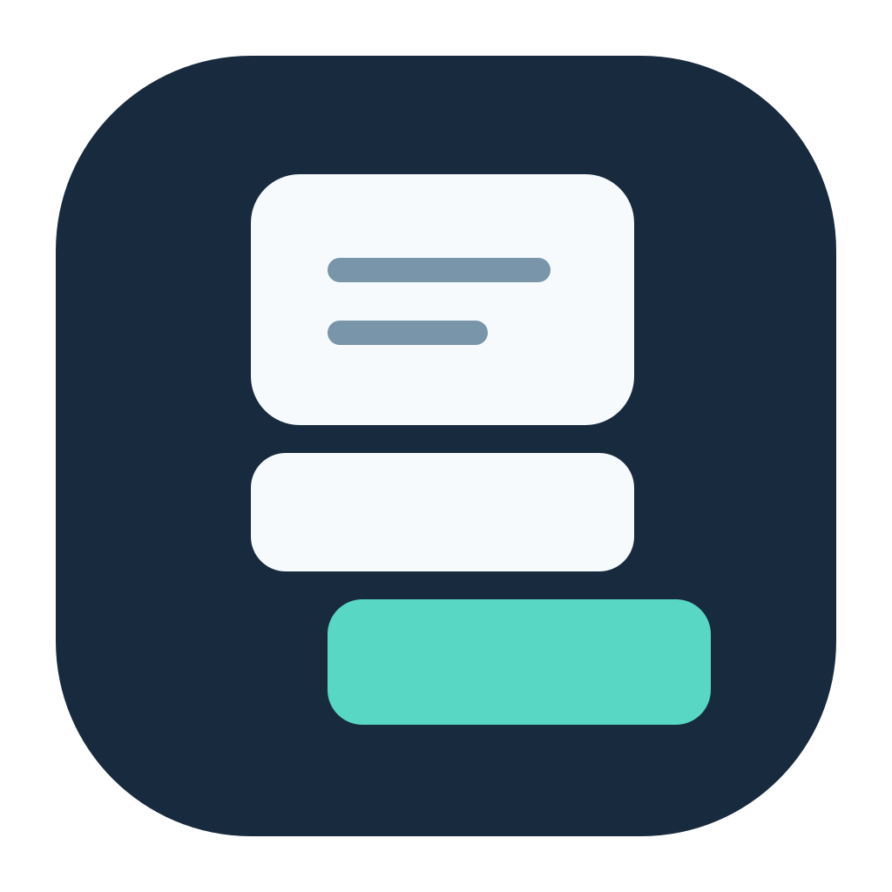
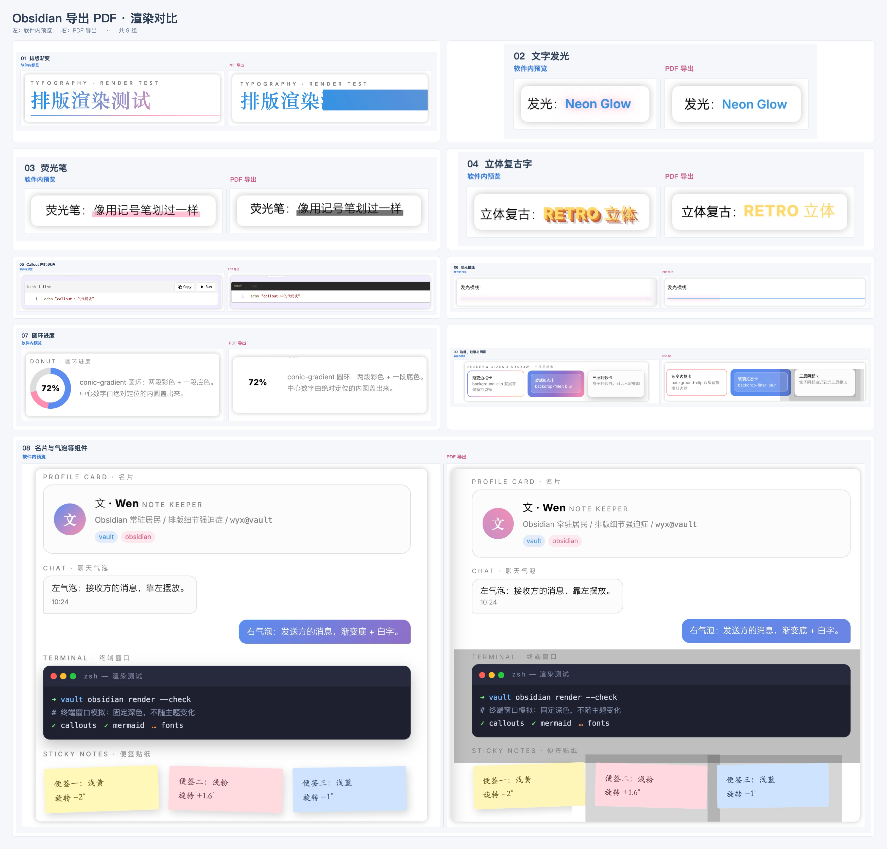
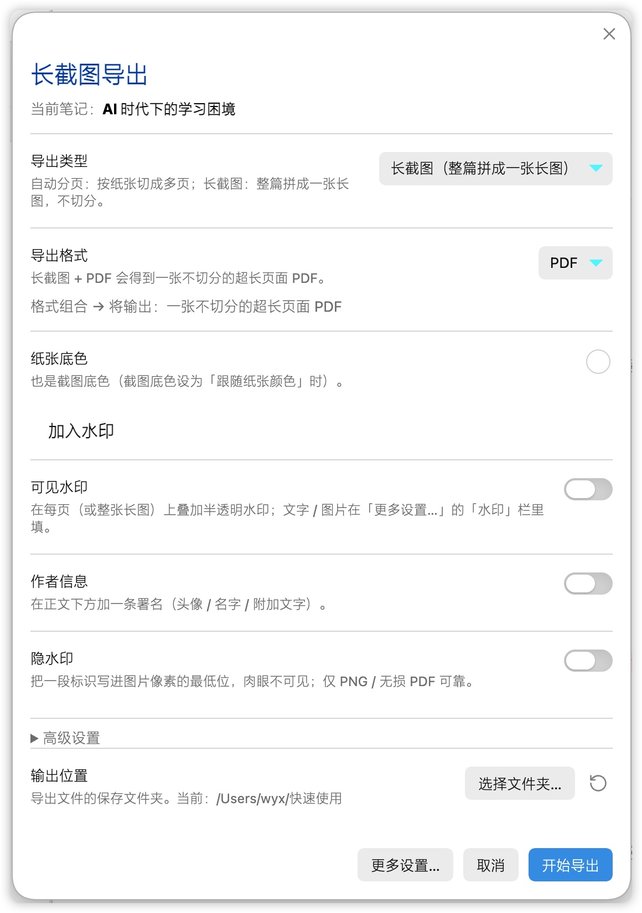
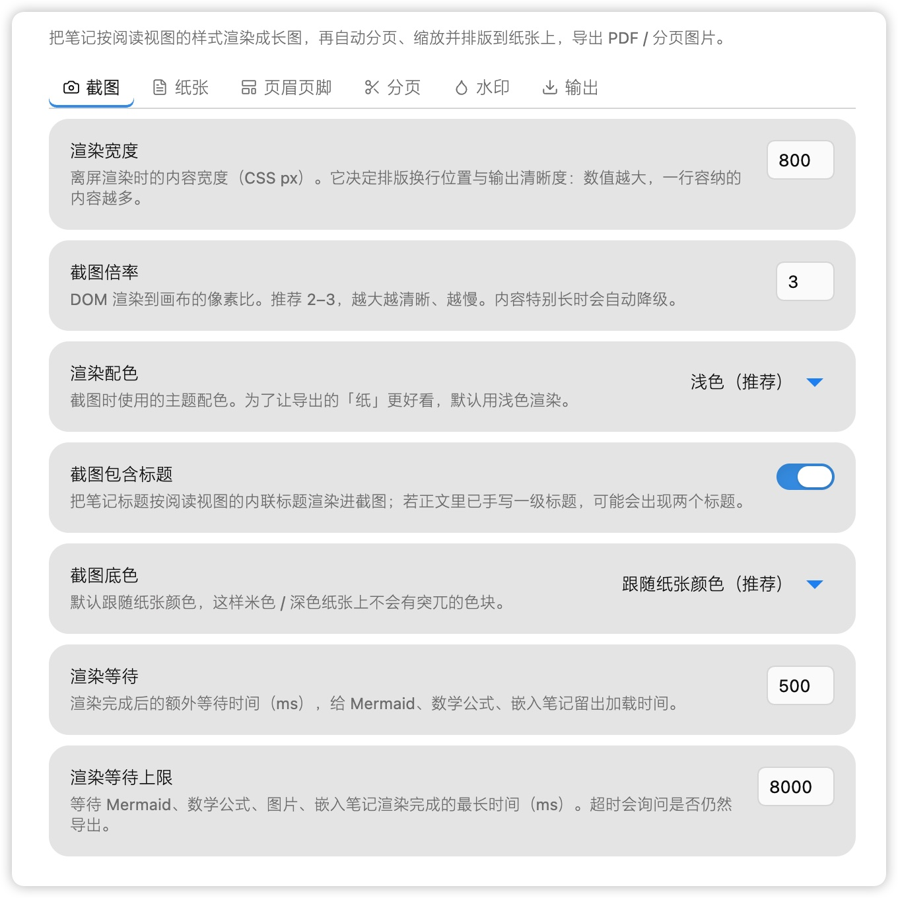
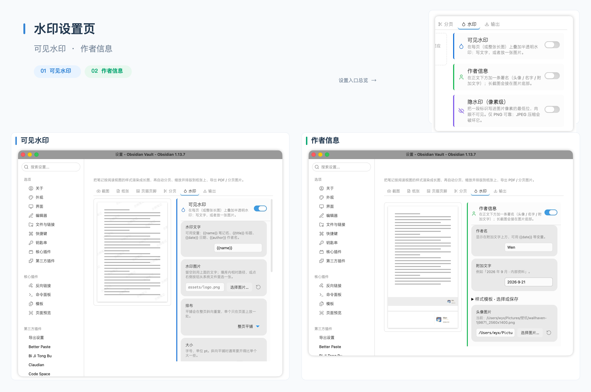

# Longshot PDF

[简体中文](README.zh.md) | English

<picture>
  <source srcset="docs/images/logo-horizontal.svg" type="image/svg+xml">
  
</picture>

Capture your Obsidian notes as long screenshots and export them as PDF, JPG or PNG. Split the result into pages, or keep the whole note in one image.

## Why I built it

My original goal was simple: export a Markdown note to PDF, then turn that PDF into an image to share. But some content that looked right in reading view changed during export. Certain rendered effects disappeared altogether. The note was already finished, yet I still had to spend time fixing the output.

Since I wanted to preserve what I could see, a screenshot seemed like a better starting point. That became Longshot PDF: capture the rendered note first, then split it into pages if needed. It can also save images directly, removing the extra PDF-to-image step.

I built this plugin to keep exported notes as close as possible to their reading view, especially notes with formulas, diagrams or custom styling. It is meant for saving and sharing those finished pages.

The image below shows the rendering differences I encountered. Each pair shows the in-app preview on the left and the PDF I exported at the time on the right. Gradients, shadows and some graphics changed during export.

<details>
<summary>View the reading-view and PDF comparison</summary>



</details>

## How it works

The plugin renders the note offscreen using reading-view styles, waits for images, formulas and diagrams to load, then captures a long screenshot. For paginated exports, it finds page breaks based on your paper size and margins, then adds any headers, footers or watermarks you have enabled.

```text
Markdown note → Reading-view rendering → Long screenshot → Split or keep whole → PDF / JPG / PNG
```

There is a trade-off: PDF content is stored as images. The plugin does not add a searchable or selectable text layer, and links in the note are not clickable in the exported PDF.

### Compared with other export plugins

| Plugin | Main use |
| --- | --- |
| Longshot PDF | Captures reading view as images and saves a long screenshot or paginated file, for sharing the note’s appearance |
| [Pandoc Plugin](https://github.com/OliverBalfour/obsidian-pandoc) | Uses Pandoc to convert notes to Word, PDF, ePub, HTML and other formats, for documents that need further editing or typesetting |
| [Better Export PDF](https://github.com/l1xnan/obsidian-better-export-pdf) | Extends PDF export with previews, outline bookmarks, page numbers, margins, internal links and multi-file merging |

For Word or ePub, consider Pandoc. For PDF links, bookmarks and merging several notes, take a look at Better Export PDF. Longshot PDF is for saving a note as images that resemble its reading view. The linked project READMEs describe the other plugins’ features.

## Download and install

Requires Obsidian 1.4.0 or later. Desktop only; phones and tablets are not supported.

1. Download `main.js`, `manifest.json` and `styles.css` from the [latest release](https://github.com/midokarin/longshot-pdf/releases/latest).
2. Create a `longshot-pdf` folder inside your vault’s `.obsidian/plugins/` directory and place the three files in it.
3. Restart Obsidian and enable Longshot PDF under **Settings → Community plugins**. Turn off Restricted mode first if it is enabled.

Your folder should look like this:

```text
Your vault/
└── .obsidian/
    └── plugins/
        └── longshot-pdf/
            ├── main.js
            ├── manifest.json
            └── styles.css
```

To update, replace those three files, then disable and re-enable the plugin. Keep `data.json`: it contains your settings.

### Interface language

The plugin follows Obsidian’s language setting. Chinese locales use Simplified Chinese; English and other locales use English. After changing the language in Obsidian, follow its prompt to restart the app.

Your note content, watermark text, author details and custom template names are not translated. The screenshots below show the Chinese interface; the same controls are available in English.

## Getting started

### Quick settings

Open a Markdown note and click the camera icon in Obsidian’s left ribbon.

1. Choose **Paginated** or **Long screenshot**, then PDF, JPG or PNG.
2. Adjust the output quality, folder and watermarks as needed. Paginated mode also has paper size and margin settings.
3. Click **Export**. To check the page breaks first, click **Preview pages…**.

Files are saved next to the current note by default. Settings are saved automatically for the next export.



### Detailed settings

Click **More settings…**, or open **Settings → Longshot PDF**, to see all options.

| Tab | Settings |
| --- | --- |
| Capture | Rendering width, capture scale, color theme and whether to include the note title |
| Paper | Paper size, margins, background and border |
| Header & footer | Text, alignment and variables such as page numbers |
| Pagination | Smart page breaks, heading and image handling, forced page breaks |
| Watermark | Text or image watermarks, author signature, avatar and style templates |
| Output | Export type, format, quality and folder |

Paginated exports use the paper size, margins, headers and footers. A long screenshot PDF uses the selected paper width and all four margins, with its height fitted to the content. It stays on one page without headers or footers. Long screenshot JPG / PNG exports save the whole note as an image.



You can also search for `Longshot PDF` in the command palette to export a paginated PDF, page images, a long screenshot or a single-page PDF. Export commands run with your saved settings without opening the quick settings panel.

## Features

### Automatic pagination

Split long notes into A4, A5, B5, Letter or custom-sized pages.

Smart page breaks prefer gaps between content blocks and try to keep a heading from being left alone at the bottom of a page. Images that fit on a page are kept together where possible. An image taller than a page may still need to be split.

If a break is in the wrong place, move it in the preview. To specify a break in the note itself, enable **Forced page breaks** and put `///` on its own line:

```markdown
This section goes on the previous page.

///

This section starts on a new page.
```

A `///` inside a code block does not trigger a page break.

### PDF, JPG and PNG

Export the same note as pages or as one long image:

| Export type | PDF | JPG / PNG |
| --- | --- | --- |
| Paginated | One multi-page PDF | One image per page |
| Long screenshot | One continuous, single-page PDF | One image containing the whole note |

Choose JPG for smaller image files. PNG’s lossless compression is useful for text, fine lines and diagrams. Choose PDF to keep several pages together in one file.

### Watermarks and signatures

Enable a watermark in quick settings, then enter its content under the **Watermark** tab in detailed settings.

A visible watermark can be text or an image. You can adjust its position, size, opacity and rotation, or tile it across the page.

For a name at the bottom, enable **Author signature**. For example, enter `Lin` as the author name and `123456@qq.com` as the additional text, with an optional avatar. There are 10 transparent style templates. Click a sample to apply it; samples use the same drawing code as exports.

Watermarks and signatures have separate switches. Signatures appear below the content on each exported page, or at the bottom of a long screenshot.



An optional pixel-level hidden watermark is also available. Use PNG when you need it: JPG compression can damage the hidden data.


## File access and privacy

Exports are processed locally. Saving outside the vault uses Node.js filesystem access to create the selected output folder and write exported files. Avatar and watermark images can also be read from paths you choose outside the vault. Existing files with the same export name are overwritten.

Hidden watermark verification reads only the PNG you select in the file picker. Batch export reads notes within the folder you choose, including subfolders. The plugin does not scan the whole vault in the background or upload notes. Remote images already linked in a note may be fetched while rendering it.

Security scanners may flag direct filesystem access because of the optional outside-vault features described above.

## License and releases

[MIT License](LICENSE). New releases attach only `main.js`, `manifest.json` and `styles.css`. GitHub Actions builds these files and generates [artifact attestations](https://docs.github.com/en/actions/how-tos/secure-your-work/use-artifact-attestations/use-artifact-attestations) so their origin can be verified. See [build notes](docs/build.md) for the local PDF-library adaptation and verification commands.
