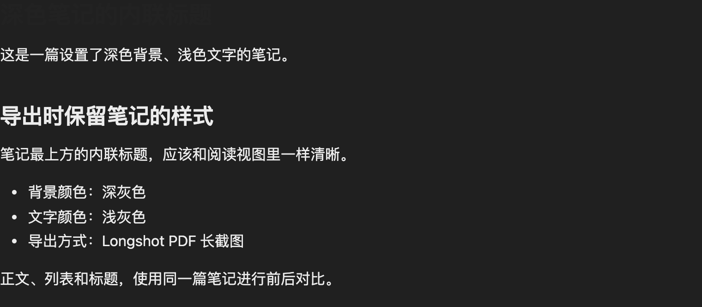
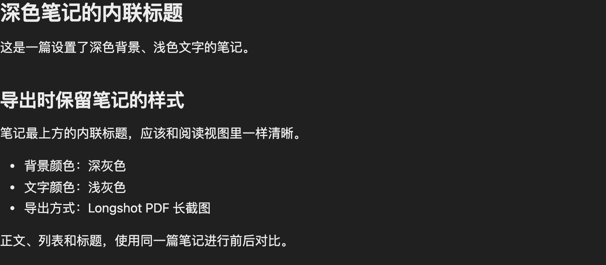

# Inline title style regression (#1)

[Issue #1](https://github.com/midokarin/longshot-pdf/issues/1) reports that an inline title loses its style and becomes unreadable on a dark note background.

## Reproduction

Verified in native Obsidian 1.14.4 on macOS, using an isolated vault and the published 0.2.4 installation files. The app uses its default light theme; the note has its own dark background.

1. Enable inline titles and create a note with this frontmatter:

   ```yaml
   ---
   cssclasses:
     - issue-dark-note
   ---
   ```

2. Enable a CSS snippet:

   ```css
   .issue-dark-note.markdown-preview-view {
     background: #202020;
     color: #ececec;
   }
   ```

3. Open the note in reading view. Its inline title is light gray (`#ececec`).
4. Export with Longshot PDF: include title, follow the current theme, use the theme background, long screenshot, PNG. The comparison below uses a width of 760 CSS pixels and 2× capture scale.

In 0.2.4, the exported title becomes `#222222` against `#202020`. These are actual plugin exports of the same test note, with identical export settings:

Before (0.2.4):



After (0.2.5):



## Cause and fix

The plugin restated title color as `var(--inline-title-color, var(--text-normal))`. When Obsidian's title color variable resolves through `inherit`, that fallback selects the app theme's text color instead of inheriting the note's text color. The plugin's high-specificity selector also overrode direct theme/snippet rules for title color and typography.

The fix removes those redundant color and typography declarations. Obsidian and the note/theme styles now supply them. The explicit display rule remains so the export's “include title” option still works when the app hides inline titles.

## Verification

- Native Obsidian: exported both PNG and single-page PDF using the plugin's render, capture and file-writing pipeline. The fixed title's color, size, weight, style and line height match the live reading view; no export warnings.
- `npm run verify:inline-title`: all 13 cases pass, including exact captured-pixel comparisons. Running with `--baseline=0.2.4` fails 6 cases and passes 7 controls.
- Existing capture/pagination harness, English/Chinese UI checks and 12 PDF placement cases pass.
- Production build, localization validation and release checks pass.
